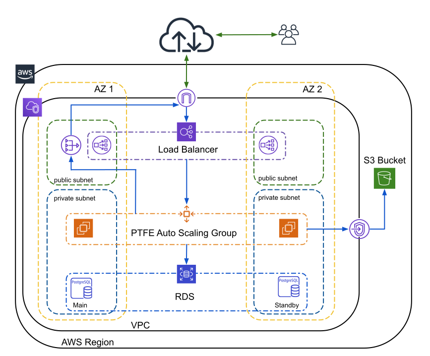

# TFEv4 AWS install

A repo with packer and terraform configurations which can be used to deploy TFEv4 in AWS. The project will install TFEv4 in AWS using external services - AWS S3 and AWS PostgreSQL RDS. 

## Contents

The repository contains:

1. A Packer project to build an AWS AMI which has docker installed and contains static files needed for the TFEv4 installation. The project is located in the `./packer` folder. Check the [readme](./packer/README.md) for details on what it does and how to use it.

2. A Terraform project to set up TFEv4 install using external services in AWS. It is located in the `./terraform` folder. The Terraform project assumes that an AMI built with the packer project above is used. 

    The Terraform code is split in several sub-modules. The root module is intended to tie together these sub-modules to bring up the Network, External Services and TFE instance itself in a single run. Check the [readme](./terraform/README.md) for details on what it does and how to use it.

    Below is a diagram of the AWS infrastructure which will be deployed

    

## TODO

- [ ] add a test for the root terraform module - the effort to add separate tests for each module is not really worthed as they would need additional configuration to be deployed and this configuration would actually be very similar to the rest of the modules.
- [ ] add automation for the initial TFC admin

### Done

- [x] packer project to create an AWS AMI with docker and static TFEv4 setup files.
  - [x] add test for the AMI
- [x] `packer` - check if AMI can be built with a smaller disk and this disk increased during EC2 instance provisioning. Should substantially reduce build time.
- [x] `packer` - make replicated installer and TFE airgap package be downloaded directly to the EC2 instance to further reduce build time.
- [x] `packer` - make it possible to install specific replicated version. 
- [x] `packer` - install ctop, htop on the AMI.
- [x] `packer` - disable periodic apt updates.
- [x] terraform sub-module to create the TFEv4 instance.
- [x] terraform module to provision a DNS record for TFE.
- [x] terraform root module to tie the sub-modules together.
- [x] terraform sub-module to create the basic network infrastructure.
- [x] terraform sub-module to external services.
  - [x] Make possible to set the RDS instance to multi-az mode.
- [x] terraform to create aws key-pair either as part of the ec2-submodule or a separate sub-module.
- [x] add a load balancer and auto-scaling group according to the reference AWS [architecture](https://www.terraform.io/docs/enterprise/before-installing/reference-architecture/aws.html).
  - [x] make the port 443 health check check the application.
  - [x] make auto scaling group set the instance `InService` only after TFE is up.
- [x] improve readmes with diagrams
